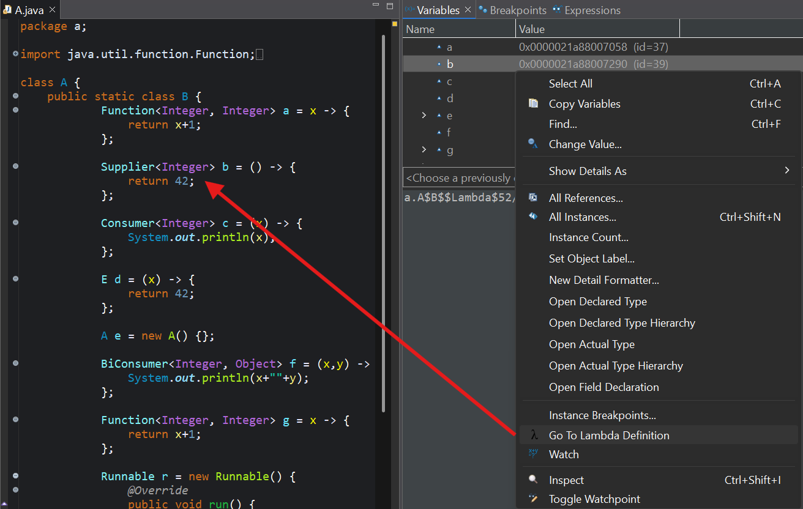

# _Go to lambda definition_ eclipse plugin

While debugging a java program, you want to inspect the content of variables. But for variables that hold a lambda function, just an ID is displayed. You know that a lambda is actually syntactic sugar for an implementation of a functional interface like `Runnable` or `Function`, so you try to "Open actual type", but it jumps to the interface instead.

This plugin provides the "Go To Lambda Definition" command that jumps to the implementation of the selected lambda variable.

## How to install
Download the released jar and put it into your eclipse installation's `dropins` folder. Upon restart of eclipse, the plugin is installed and the command is available.

## How does it work?
The Java compiler converts the lambda function into a static method on the class where it is defined. Then, a small class that implements the correct functional interface (like `Consumer`) is generated. The function of this class that implements the functional interface (like `accept`) processes arguments and then invokes the static function. At runtime, an instance of this class is assigned to the variable, in place of the lambda function.

When clicking "Go To Lambda Definition", the underlying type of the variable's value is retrieved, which is the generated class. Via [JDWP](https://docs.oracle.com/javase/7/docs/platform/jpda/jdwp/jdwp-protocol.html) the bytecode of the `accept` method is loaded. We [parse the bytecode](https://docs.oracle.com/javase/specs/jvms/se21/html/jvms-6.html) and search for the `invokestatic` opcode, whose argument is a `MethodRef` index. This index is looked up in the [constant pool](https://docs.oracle.com/javase/specs/jvms/se21/html/jvms-4.html#jvms-4.4) of the generated class (again via JDWP), and the name of the static function is extracted from there.

In contrast to the generated class, the static method has location information available via JDWP, so jumping to this function is now easily implemented, similar to existing eclipse commands.

## Contributing
Feel free to create issues and pull requests.

